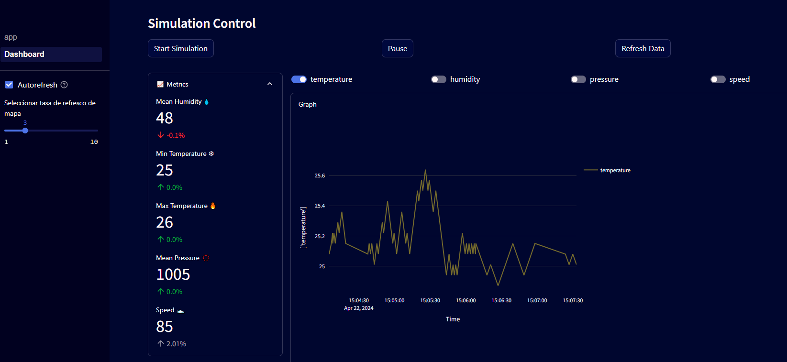
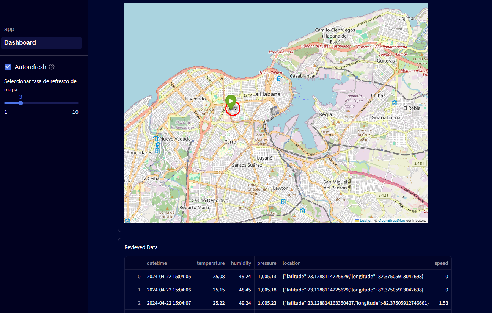

# **Aplicación de dashboard de tiempo real con simulación de sensor IoT**

Esta aplicación es un dashboard de tiempo real que simula la lectura de datos de un sensor IoT. El objetivo es proporcionar una demostración de cómo crear un tablero interactivo que refleje los cambios en los datos del sensor en tiempo real.




### Requisitos previos
- [Python](https://www.python.org/downloads/) instalado en tu sistema.
- [Docker](https://www.docker.com/get-started) instalado si prefieres ejecutar la aplicación en un contenedor Docker.
 
### Ejecución local

#### Clonar el repositorio
1. Abre una terminal.
2. Ejecuta el siguiente comando para clonar el repositorio:

   ```cmd
   git clone https://github.com/renzzo1904/demo-analyticsapp-on-sensor-data

3. Navega hasta el directorio

    ```cmd
    cd demo-analyticsapp-on-sensor-data

4. Instala las dependencias    

    ```cmd
    pip install -r requirements.txt

5. Inicia la app usando Streamlit `run` en el cmd o bash.

    ```cmd
    streamlit run app/App.py

5. Navega hasta la dirección local donde la app está corriendo. Streamlit debería hacerse cargo de abrir el naevgador de manera automática. 

## Instalar con Docker

Construir la imagen Docker
1. Abre una terminal.
2. Navega hasta el directorio del proyecto donde se encuentra el archivo Dockerfile.
3. Ejecuta el siguiente comando para construir la imagen Docker:
    ```cmd 
    docker build -t nombre_de_la_imagen .
4. Después de construir la imagen, ejecuta el siguiente comando para iniciar el contenedor Docker:
    ```cmd 
    docker run -p 8501:8501 nombre_de_la_imagen
5. Abre tu navegador web y ve a http://localhost:8501 para ver el tablero en tiempo real.

Espero sea de utilidad!

